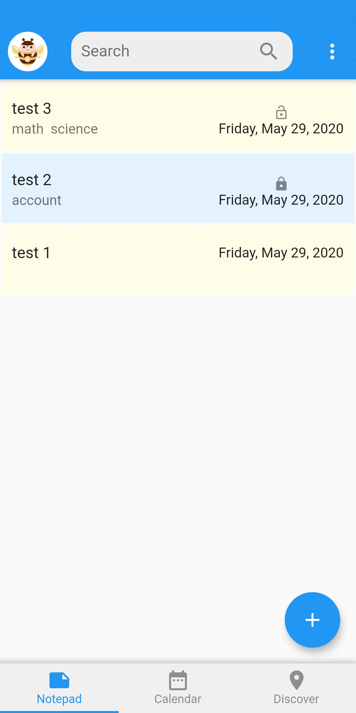
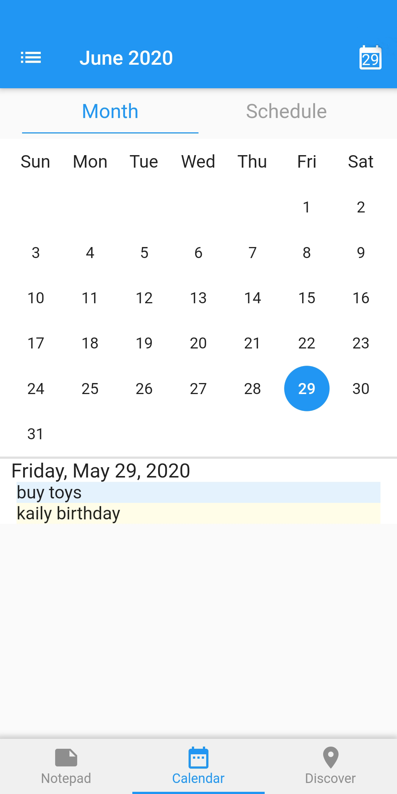

# ENotes
#### [中文版文档](https://github.com/nalaws/ENotes/blob/master/README.md)   |   [English Docs](https://github.com/nalaws/ENotes/blob/master/README-EN.md)

ENotes是一款简单安全有趣的本地便签APP，能够很好的帮助用规划户日常生活和提高工作效率。

## 预览

部分页面效果如下：

|     |      |    |
| :--------------------------------: | :---------------------------------: | :-------------------------------: | 
|     |      |    |

## 主要功能

* [x] 创建记事本
* [x] 记事本加密
* [x] 记事本添加标签
* [x] 记事本搜索
* [x] 设置头像
* [x] 设置座右铭
* [x] 二维码识别和生成
* [x] 文本识别
* [x] 日历(支持农历)
* [x] 设置日程
* [x] 设置纪念日

## 体验：

Android版安装包：[点击下载](https://raw.github.com/nalaws/ENotes/master/bin/v1.0.0/supwallet.apk)

iOS暂时不支持

## 赞赏

如果这个软件对您有帮助，您愿意支持这个项目的进一步开发和维护。你可以扫描下面的二维码，请我喝一杯咖啡。非常感谢您的捐赠。谢谢！

    

